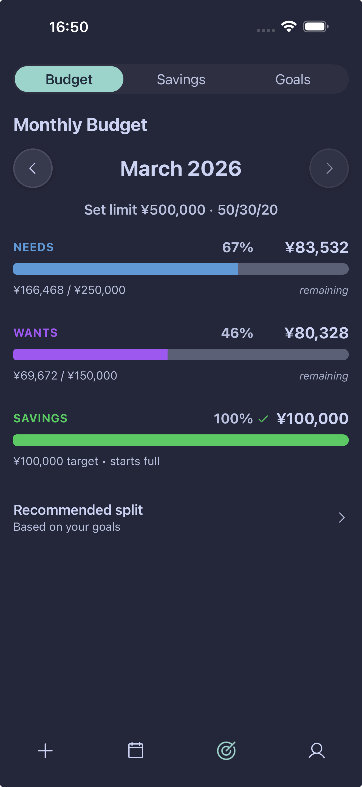
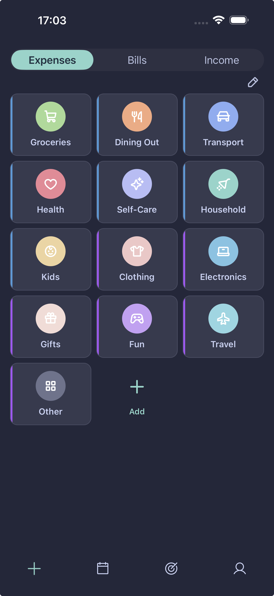

# 👋 Howdy, I’m TomCat

**Founder of Tom Cat Labs**  
Building **Expensei** - a visual budgeting system designed around behavioral finance.

<picture>
  <source media="(prefers-color-scheme: dark)" srcset="https://raw.githubusercontent.com/TomCat-415/TomCat-415/output/github-snake-dark.svg" />
  <source media="(prefers-color-scheme: light)" srcset="https://raw.githubusercontent.com/TomCat-415/TomCat-415/output/github-snake.svg" />
  
</picture>

## 📱 Expensei

Expensei is a mobile budgeting system that organizes spending into three simple pillars:

🟦 **Needs**  
🟪 **Wants**  
🟩 **Savings**

Most finance apps bury users in transaction lists and spreadsheets.

Expensei focuses on **visual financial awareness**.

Every expense flows into a pillar so users can instantly see how their spending aligns with the classic **50 / 30 / 20 budgeting rule**.

The goal is simple:

> make financial awareness effortless.

---

  
  

  
    <b>Left:</b> Visual budgeting with the three pillars: Needs, Wants, Savings. 
    <b>Right:</b> Categories inherit pillar colors so you instantly see where spending belongs.
  

---

### GitHub Stats

---

### Streak Stats

---

### Trophies

---

### Most Used Languages

---
