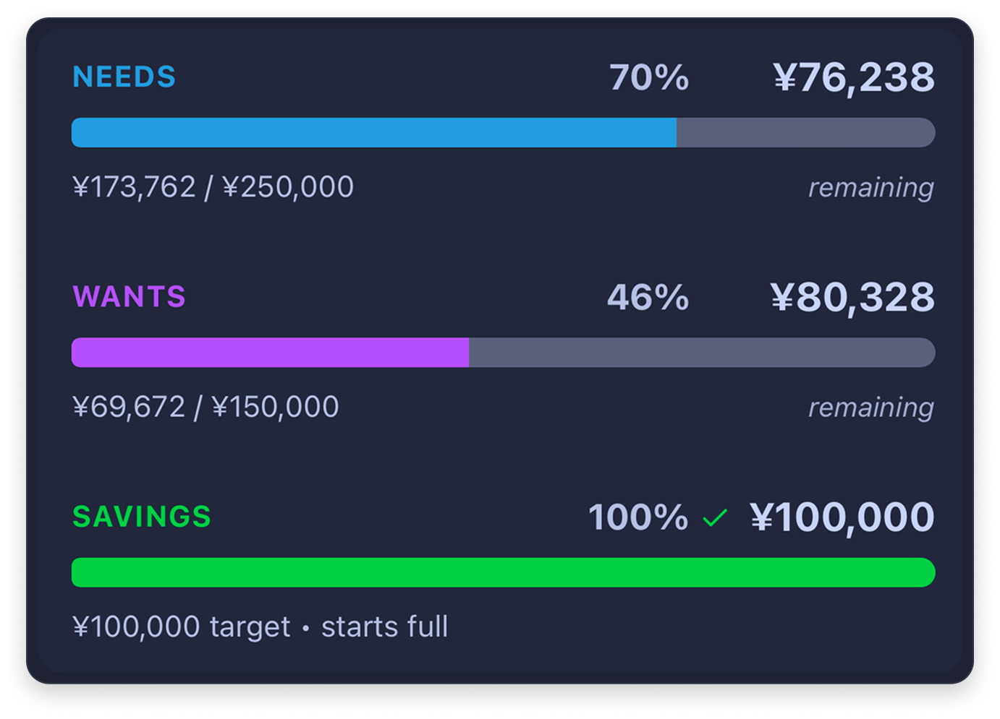

# 👋 Howdy, I’m TomCat
<picture>
  <source media="(prefers-color-scheme: dark)" srcset="https://raw.githubusercontent.com/TomCat-415/TomCat-415/output/github-snake-dark.svg" />
  <source media="(prefers-color-scheme: light)" srcset="https://raw.githubusercontent.com/TomCat-415/TomCat-415/output/github-snake.svg" />
  
</picture>

**Founder @ Tom Cat Labs**  

📱 Building **Expensei** • visual budgeting based on the **50/30/20** rule

Spending categories roll up into Needs and Wants, while Savings tracks progress toward your monthly goal:

  

**Built with:** React Native (Expo) • Supabase (Postgres) • TypeScript

• **Offline-first syncing** with a persistent queue  
• **Ledger-style transactions** so transfers stay correct  
• **Snapshot-backed monthly views** for fast history and recaps

🚧 Private alpha • Public beta coming soon (iOS TestFlight + Android)

---

